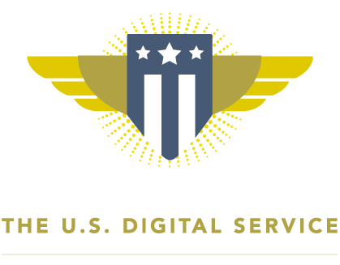

I've worked for local government for the past 3 years. As I [previously mentioned](../learning-what-to-learn/), it can be both infuriating and incredibly rewarding, usually simultaneously.

## Working for government

I play a small part in delivering local government services. Our services have a wide range, from recreational to life-saving.  My place of work [opens shelters when it's cold](http://www.clackamas.us/socialservices/help.html) and helps [keep heat and lights on](http://www.clackamas.us/socialservices/energy.html) in homes when people can't afford it. We [maintain public parks](http://www.clackamas.us/parks/), [clean wastewater](http://www.clackamas.us/wes/), and [provide dental services](http://www.clackamas.us/healthcenters/). We [help get businesses up and running](http://www.clackamas.us/business/assistance.html) and [find homes for lost and abandoned dogs](https://www.youtube.com/playlist?list=PLZEzoOaZqnfriP3r86RM14nT8Q0Wc8BXa). 

Prior to working in government, I sought meaningful work in the nonprofit and academic sectors, but until I started working for county government, I hadn't worked anywhere that offered so many ways in which to serve the public and the environment. 

As with much of government in our country, we aren't exactly revolutionary in our approach to digital services, but we're getting better. Frankly, when it comes to web content, the challenge is often to convince staff to _do less_ as opposed to more. Government has a habit of telling people to (for example) wear an extra layer of warm clothing when it's cold or be safe around their barbecues during summer holidays (these aren't made up). A huge part of my job is convincing staff to focus on the content that helps our web users complete a task related to a government service. Often, that means omitting much of what a staff member proposed in the draft they handed me (that's where the so-called "soft skills" come in). And that's just content; tech in government faces challenges both bureaucratic and cultural (the culture being, in large part, bureaucratic).

It's taking government a long time to catch up with the private sector when it comes to digital (as with many other things). But under the Obama administration, we saw an acceleration in digital services on the federal level that may prove to be a game changer, even beyond the technology itself.

## Redefining government digital

[Much has been written](https://www.fastcompany.com/3046756/obama-and-his-geeks) about the [US Digital Service](https://www.usds.gov/), so I won't attempt to tell the whole story. In brief summation, the USDS was formed by President Obama's administration in the wake of the healthcare.gov fiasco. The administration (viz., [Todd Park](https://www.wired.com/2014/08/healthcare-gov/)) brought in [Mikey Dickerson](http://money.cnn.com/2017/01/17/technology/us-digital-service-mikey-dickerson/) and other Silicon Valley folks to fix it (which they did). The story is worth reading, if you haven't.

While USDS and its sister agency [18F](https://18f.gsa.gov/) perhaps haven't quite revolutionized government digital in the way that [GOV.UK](https://www.gov.uk/) has done across the pond, they have made huge strides in building a 21st Century digital government. **More than that, they ignited a passion and civil service ethos that has been largely dormant in many sectors of our society.** That may end up being their biggest contribution to our country.

## Digital civil service

After college, I spent a year in [AmeriCorps](https://www.nationalservice.gov/programs/americorps) removing invasive species, learning about native plants, and restoring stream banks. For those who haven't heard of AmeriCorps, I often describe it as the domestic PeaceCorps. 

I made about $3.75/hour that year, plus about $4500 toward grad school, but I learned an enormous amount about our country's watersheds and participated in the restoration of dozens of acres of salmon-bearing habitat.

In college, I was completely broke, like many college students. So when I left, I didn't have much to lose. Having graduated in philosophy, my career path wasn't predetermined either. It wasn't a significant sacrifice to my income and career prospects to spend a year serving my country in AmeriCorps.

Contrasting with my first foray into civil service, leaving Google and presumably a relatively enormous income to rescue a failing website upon which millions would depend for, not their livelihoods _but their very lives_, Mikey Dickerson (and many others at USDS) has certainly lived up to the term "public servant." 

USDS, [Code for America](https://www.codeforamerica.org/), and 18F have forged new pathways for civic participation, leading efforts to [recruit others to join them](https://medium.com/the-u-s-digital-service/south-by-southwest-one-year-later-5fc6e677aead#.k1v6peyzj) in enlisting technology to make our country work better for everyone.

I have been inspired by the work of USDS, and I hope to continue to be inspired. We will need them now more than ever. 

[As he says farewell to USDS](https://medium.com/the-u-s-digital-service/youll-never-be-the-same-again-dc5b16b84ba9#.a540x9h4o), I would like to offer my gratitude for all Mikey Dickerson has accomplished. His efforts at USDS have not only improved the lives of countless Americans who have earned and rely on government services, but his work has inspired government technologists throughout the country, federal, state, and local, including myself.

More importantly, he's proved that civil service is alive and well in the US.

