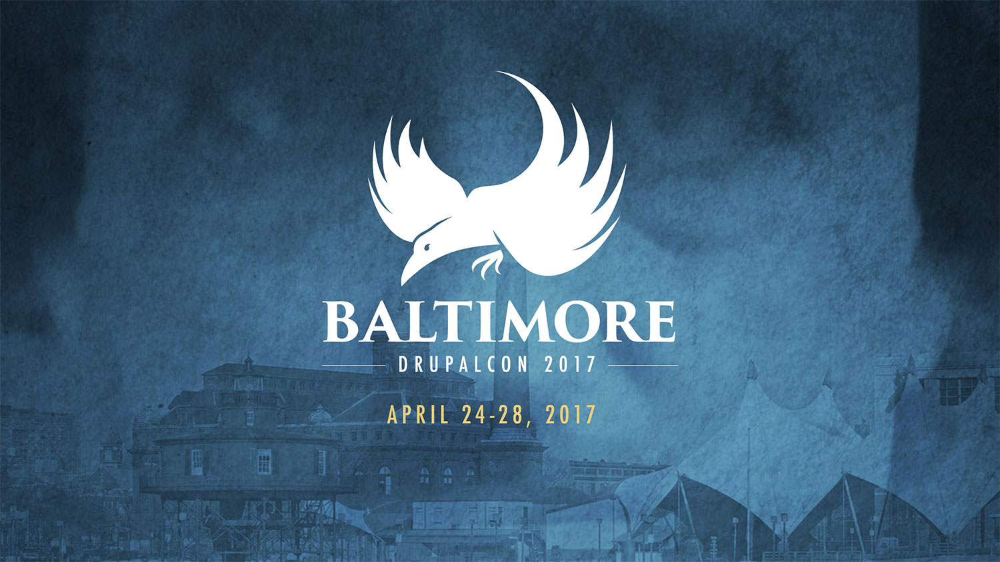
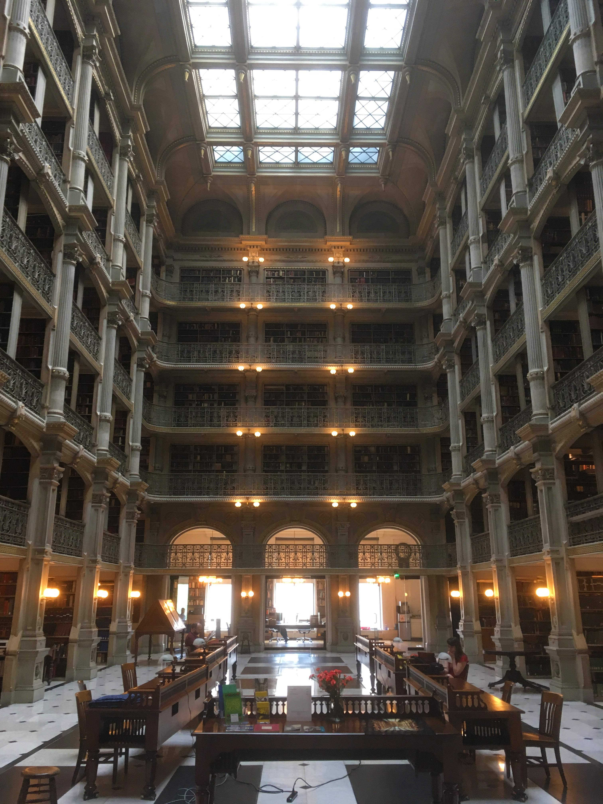
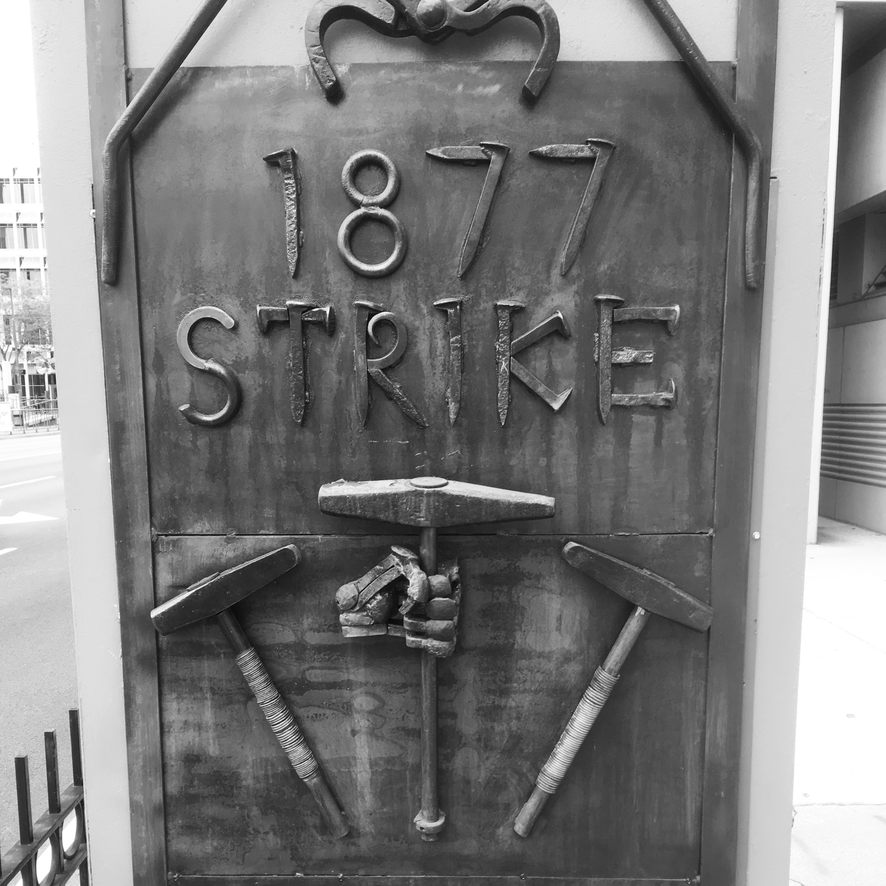

I just returned from DrupalCon in Baltimore. It was my first DrupalCon, but it felt like the continuation of a journey back to Drupal after a relatively long absence.

I haven’t worked with Drupal regularly since 2013, when I managed a Drupal site at Oregon State University (Sea Grant Extension). Even then, I was working on the site more as a project manager than a designer, developer, or content strategist. I rarely had to worry myself with the configuration or codebase. 

With a pending migration to Drupal 8 at the government agency I now work for, it was time to dig in to Drupal 8 as much as possible and accelerate my comprehension of Drupal 8 as a platform for our new site.

## Baltimore

I hadn’t been to Baltimore before. Based on what I heard before I left, I was’t expecting to be impressed. But I enjoyed the city immensely, and I found the people there to be friendly and helpful.

Plus, there’s the stunning [Peabody Library](http://peabodyevents.library.jhu.edu/) next door to the Washington Monument. I can’t say enough about this library; it is a brilliant structure with prodigious historical and literary value. I visited the library, the monument, and the nearby Walters Art Museum on my last afternoon in the city.

Art can be found throughout the city; I saw some compelling work on the bus stops around the convention center.

## DrupalCon gets awkward

There was an underlying awkwardness to DrupalCon this year, as [a confrontation between the founder of Drupal and a member of the Drupal community](http://buytaert.net/thoughts-as-we-head-to-drupalcon-baltimore) just prior the conference threatened to overshadow the proceedings. I read about this drama just two days before the start of the conference, and I noticed many of the conference participants watching the opening keynote by Drupal founder Dries Buytaert didn’t seem to know what was going on when the topic was addressed at the outset of the presentation.

In the end, the confrontation didn’t seem to impact much of the conference and appeared to be limited to the core of the Drupal community, which is comprised of relatively few people compared to the community as a whole.

## DrupalCon goes far beyond DevOps

Before registering for DrupalCon, I assumed the conference was focused on development and developers, which seemed to make sense. After all, the Drupal community is comprised largely of those who build Drupal and develop contributed modules that augment its functionality.

For years, Drupal has been a premier publishing platform for the web, and so I shouldn’t have been surprised to see a number of sessions focused on content strategy, content management, and the publishing experience. 

## Highlights
On the opening day of the conference, I decided to attend the Content Strategy training instead of the Government Summit. I felt I needed the hands-on experience, though I heard the Government Summit was excellent.

### Sessions
There were several strong sessions at DrupalCon this year. Here is a list of the sessions that were most interesting and/or beneficial to me:

* [**The Right Tool for the Job: Content Layout in Drupal 8**](https://www.youtube.com/watch?v=Z9QaeGiZVLA&t=1s&list=PLpeDXSh4nHjRbDdwHEBRHItfnjrJ8kEDK&index=67)  
Kathryn McClintock (_Kathryn’s talk was so popular, she had to give it twice in row and filled the room each time_)

* [**Making mass.gov data-driven and constituent-centric**](https://www.youtube.com/watch?v=y58q823EB5M&t=1060s&list=PLpeDXSh4nHjRbDdwHEBRHItfnjrJ8kEDK&index=27)  
Bryan Hirsh and Moshe Weitzman

* [**Our New Typography: Variable Fonts & the Future of Web Design**](https://www.youtube.com/watch?v=jD8pJVKShDo&list=PLpeDXSh4nHjRbDdwHEBRHItfnjrJ8kEDK&index=53)  
Jason Pamental

* [**Content Strategy in Popular Culture, Part Deux**](https://www.youtube.com/watch?v=tosvGs_i2Pk&index=138&list=PLpeDXSh4nHjRbDdwHEBRHItfnjrJ8kEDK)  
Brett Meyer

* [**BCBS.com: Pushing the Design Limits with Paragraphs**](https://www.youtube.com/watch?v=3e1EWT4BZKA&index=155&list=PLpeDXSh4nHjRbDdwHEBRHItfnjrJ8kEDK)  
J Hogue and John Eckroth

* [**Content Before Code: A D8 Case Study**](https://www.youtube.com/watch?v=sbQZQw4Eef4&index=167&list=PLpeDXSh4nHjRbDdwHEBRHItfnjrJ8kEDK)  
Michelle Jackson and Bec White

Because they were concurrent, I missed several sessions I would have liked to attend. Thankfully, the sessions are all on the [Drupal Association’s YouTube channel](https://www.youtube.com/playlist?list=PLpeDXSh4nHjRbDdwHEBRHItfnjrJ8kEDK).

## Nashville 2018
I’m already looking forward to next year’s DrupalCon in Nashville.

