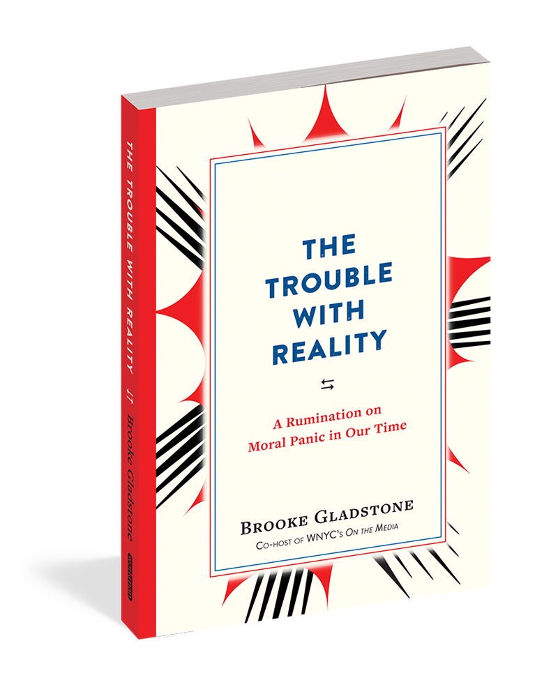

I’ve been seeking a way to describe the feeling of watching reality crumble around us in the wake of the election. I’m sure some would describe that statement as hyperbolic, and that’s part of why it’s been so difficult to describe.

For those of us who believed – perhaps with a considerable amount of privilege – that we had progressed beyond widespread racism, xenophobia, and hate; that we collectively valued democracy enough that we could, at the very least, recognize authoritarianism’s creep into our political institutions; that our collective skepticism of corporations and Wall Street was an implicit, unifying understanding that the biggest threat to our nation and our livelihoods was capitalism itself and the inexorable inequality that is its inevitable outcome; these assumptions about reality turned out to be utterly false. 

For me, no one has captured this feeling – this panic – as completely, and in so few pages, as Brooke Gladstone, co-host of WNYC’s _On the Media_. In just 92 pages, Gladstone traverses our political moment with a sobering salt-sniff, simultaneously enhancing our panic while unpacking it, all with the tenacious confidence that knowledge is still power.

Appealing to George Lakoff, Hannah Arendt, Jonathan Swift, William James, George Orwell, Aldous Huxley, John Milton, John Adams, Thomas Jefferson, and more, Gladstone surveys authoritarianism’s rise throughout history as witnessed or analyzed by these authors, and how the common tactics of authoritarian rule have been routinely employed in the rise of Trump.

## Orwell and Huxley

One of the most compelling sections of the book focuses on the contrasting portrayals of dystopian authoritarian rule as conveyed in George Orwell’s _1984_ and Aldous Huxley’s _Brave New World_. Here, Gladstone relies on Neil Postman’s 1985 work _Amusing Ourselves to Death_, which she describes as “the most incisive, impassioned warning label ever issued on our media diet.”

> In Orwell’s vision, he notes, we are crushed by a merciless oppression imposed by others, whereas in Huxley’s vision, we are seduced, sedated, and satiated. We enslave ourselves.

 > “What Orwell feared were those who would ban books. What Huxley feared was that there would be no reason to ban a book, for there would be no one who wanted to read one. Orwell feared those who would deprive us of information. Huxley feared those who would give use so much information that we would be reduced to passivity and egoism.”
 
As [book readership in America continues to decline](http://www.latimes.com/books/jacketcopy/la-et-jc-fewer-americans-reading-books-20151021-story.html), while information overload and [gaslighting](https://www.washingtonpost.com/posteverything/wp/2016/11/07/the-trump-campaigns-war-on-reality-made-me-question-what-i-saw/?utm_term=.7f619b918257) challenge our ability to discern fact from fiction, Huxley’s vision indeed seems to be winning the day.

## Is authoritarianism inevitable?

Gladstone quotes from a letter John Adams wrote at the dawn of the American democratic project in 1814:

> Remember Democracy never lasts long. It soon wastes exhausts and murders itself. There never was a Democracy Yet, that did not commit suicide. It is in vain to Say that Democracy is less vain, less proud, less selfish, less ambitious or less avaricious than Aristocracy or Monarchy....Those Passions are the same in all Men under all forms of Simple Government, and when unchecked, produce the same Effects of Fraud Violence and Cruelty....Individuals have conquered themselves, Nations and large Bodies of Men, never [sic].

I refuse to believe that our creep into fascism was inevitable, but it is happening nonetheless, and we need to adjust our reality to accommodate its modern instantiation.

## We have work to do

As I write this, we’re dealing with the aftermath of [the murder of two men who defended muslim women](http://www.oregonlive.com/portland/index.ssf/2017/05/police_responding_to_ne_portla.html#incart_big-photo) from aggressive verbal abuse on a light rail train here in Portland. 

Now, I’m not suggesting that this couldn’t have happened if Trump wasn’t the president (or a presidential candidate), but it is no coincidence that [hate crimes rose 20% in 2016](http://www.nbcnews.com/news/us-news/u-s-hate-crimes-20-percent-2016-fueled-election-campaign-n733306) and Trump’s campaign rhetoric and inner circle of white supremacists [have created safe spaces and emboldened racists](https://www.salon.com/2017/03/08/trumps-election-has-created-safe-spaces-for-racists-southern-poverty-law-centers-heidi-beirich-on-the-wave-of-hate-crimes/).

In our old reality, all people are created equal and America is a melting pot of diversity; those were our strengths, not our weaknesses.

In Trump’s America, people are verbally abused or even killed on account of race, religion, or defending basic decency and rejecting blind hatred. This was all happening during the campaign, and if you voted for Trump, you own part of this new reality. It wasn’t hiding. [He wasn’t hiding](https://www.vox.com/2016/7/25/12270880/donald-trump-racism-history).

We have work to do to rebuild our reality. As Gladstone writes:

> We can’t simply retreat back into our own realities after what we’ve seen. Though we are quite adept at not seeing, _unseeing_ is an altogether different matter. We experienced reality crash. Now our reality is going to need some tweaking.

