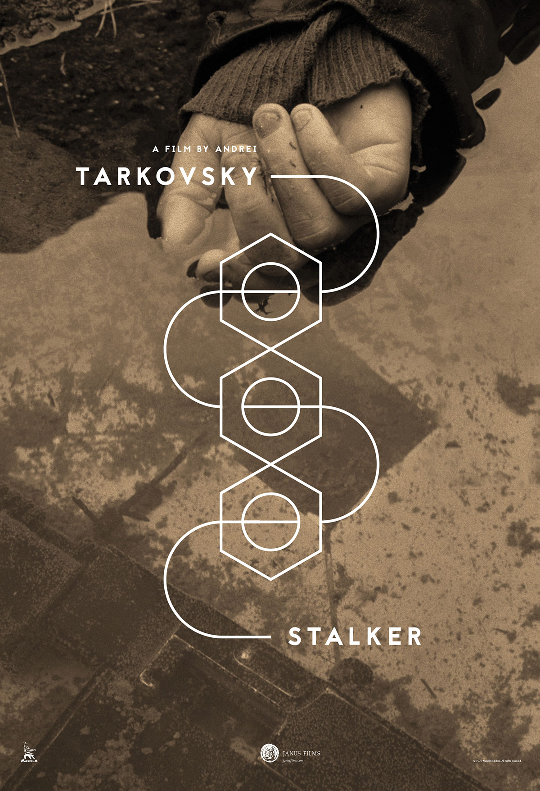
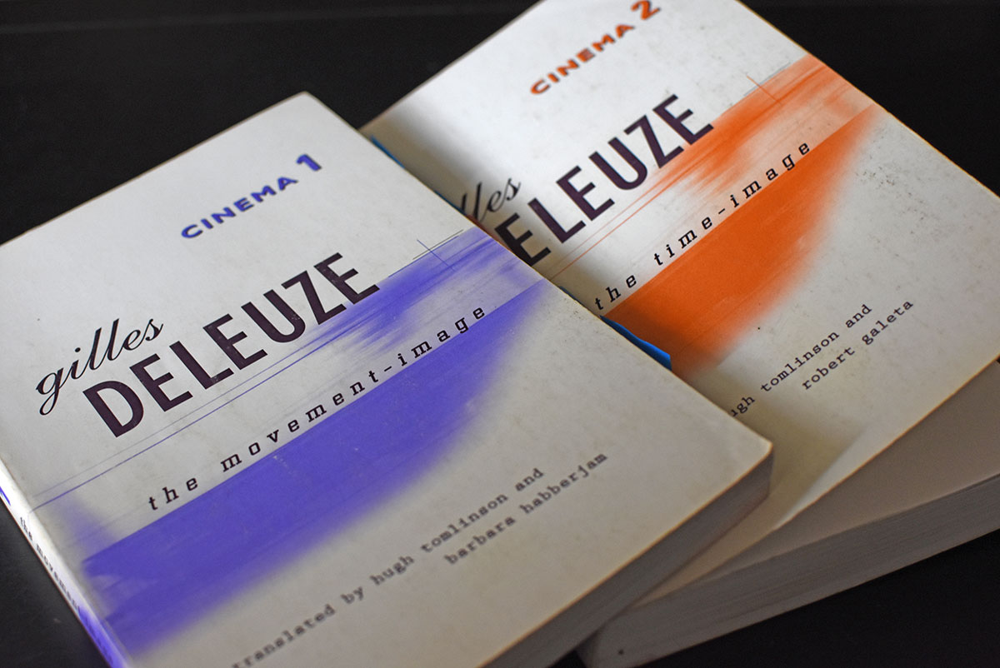
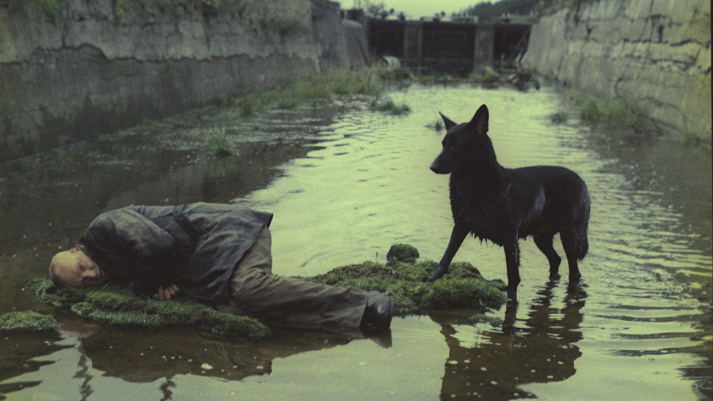

Tarkovsky’s haunting 1979 film _Stalker_ has been digitally remastered and is in the middle of an arthouse run. Widely considered Tarkovsky’s best film, it was also his most demanding to make, with some speculation that the [primary film location may have caused Tarkovsky’s death](http://www.tasteofcinema.com/2016/8-famous-directors-who-died-or-almost-died-making-their-films/).

I watched _Stalker_ again the other day (and for the first time on the big screen), and it reminded me once again why Tarkovsky is among the greatest filmmakers of all time.

The first Tarkovsky film I saw was [_Andrei Rublev_](https://www.criterion.com/films/300-andrei-rublev) in college, and I was immediately captivated by Tarkovsky’s style. In reviewing _Andrei Rublev_, Steve Rose of _The Guardian_ [aptly describes each film in Tarkovsky’s oeuvre](https://www.theguardian.com/film/2010/oct/20/andrei-rublev-tarkovsky-arthouse): “It is not a film that needs to be processed or even understood, only experienced and wondered at.” 

Geoff Dyer, also of _The Guardian_, [says of _Stalker_](https://www.theguardian.com/film/2009/feb/06/andrei-tarkovsky-stalker-russia-gulags-chernobyl), “...it's not enough to say that Stalker is a great film - it is the reason cinema was invented.”

## Time

The title of Tarkovsky’s 1986 book, _Sculpting in Time_, identifies the key ingredient of all cinema, but one which Tarkovsky uses to mesmerizing effect: time.

French philosopher Gilles Deleuze analyzes a turning point in cinema with respect to the way in which time is employed in his 1986 works on cinema, _The Movement-Image_ and _The Time-Image_. 

>Why is the Second World War taken as a break? The fact is that, in Europe, the post-war period has greatly increased the situations which we no longer know how to react to, in spaces which we no longer know how to describe. These were ‘any spaces whatever’, deserted but inhabited, disused warehouses, waste ground, cities in the course of demolition or reconstruction.

Deleuze isn’t referring specifically to _Stalker_ or Tarkovsky’s films in general in this preface to _Cinema 2: The Time-Image_, but it couldn’t characterize _Stalker_ better. And although the above passage describes the destructive aftermath of World War II to both cities and psyches, it could very well describe the deep loss of our environmental systems as well. _Stalker_ is, after all, set in a post-apocalyptic landscape resulting from some kind of disaster. This is where the film and real life converge, as the main location of the film was a toxic, contaminated hydroelectric facility in Tallinn that was likely fatal to at least three members of the cast and crew. And the film foreshadowed the Chernobyl disaster, which would occur just 7 years after _Stalker_ debuted. 

<iframe src="https://player.vimeo.com/video/213701012" width="100%" height="394" frameborder="0" webkitallowfullscreen mozallowfullscreen allowfullscreen></iframe>

<a href="https://vimeo.com/213701012">Exclusive: STALKER TRAILER - New Restoration 2017</a> from <a href="https://vimeo.com/theplaylist">The Playlist</a> on <a href="https://vimeo.com">Vimeo</a>.

According to Deleuze, our collective crisis of belief in pre-war institutions and ideas, along with the profound loss of our environment, results in a post-war cinema that is “a cinema of the seer and no longer of the agent.” The cinema of the seer is what gives rise to the time-image.

The time-image is contrasted by the movement-image and the action-image.

>This organic and spiral representation has, as its formula, SAS’ (from the situation to the transformed situation via the intermediary of the action).

Contrasted with the movement-image, we find in the time-image the crisis that interrupts the action of the movement-image.   The underlying assumptions that informed the agency of movement-image cinema have been lost, and our subjects now find themselves in situations within which they do not know how to act, unspooling time without movement. 

The crisis of belief informs _Stalker_ throughout; it is the main theme of the film. The Room can fulfill one’s innermost desire, but only when one believes in it utterly. The crisis of belief when the Stalker, the Professor, and the Writer arrive at the Room exemplifies the time-image. The film’s subjects, bereft and indecisive, have lost something that perhaps could be regained, if they could only believe. It’s this tension between belief and action that paralyzes the film’s subjects and leaves us untethered in time.

