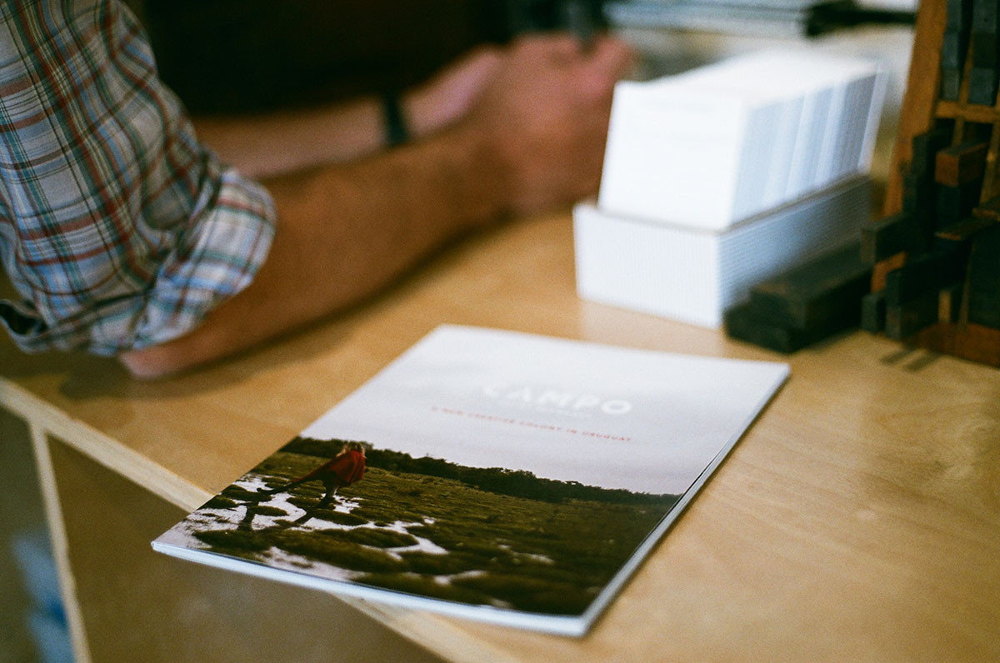

A couple weeks ago, I attended a book reading at Working Library, a project of the [c3 incubator](http://www.c3initiative.org/incubator.html) in the St. Johns neighborhood of Portland. 

Working Library is my kind of scene; the place is full of books, but it is – as the name implies – a _working_ library. Books are not just _read_ here; books are _made_ here.

The reading was by Chelsea Werner-Jatzke, who collaborated with Laura O’Quin – a Working Library founder – to create _Thunder Lizard: A Proposal to the International Commission of Ecological Nomenclature_. [Laura O’Quin](http://www.lauraoquin.net/) describes the project this way:

>Mostly you are right about things. Especially animals, and I’m an animal, so maybe you are right about me. This is an excerpt from the poem, The Most Colossal Animal Ever Just Found Out West from the manuscript, Thunder Lizard (Dinosauria, Sauropoda) written by Chelsea Werner-Jatzke.

>This signature is a study of the poetics of scientific error. A compact edition with complete text reproduced micrographically. It is accompanied by a 4x magnifying looking glass that generates a discursive position between the tiny 4pt text and the reader.

Analog tools to read analog books. 

Working in digital everyday as an occupation, it’s refreshing and centering to work with analog. I appreciate when my work results in an artifact, a physical relic, something tactile. To that end, I shot the photos at Working Library with my old Nikon F3HP film camera. 

I hardly ever print my digital photos. The existence of my digital photos remains tenuous, passive, and ephemeral, subject to cloud hosting agreements and the technical reliability of external hard drives (both of which are suspect).

Perhaps this is why Working Library is such compelling project. 

I enjoy writing this blog, but this post won’t live on forever. I’ve written blog posts that have disappeared with their expired hosting agreements, never to return. I’ve written blog posts that were backed up on hard drives that no longer work. I’m not comparing this blog to the books being printed and bound at Working Library; indeed, much of what is written digitally these days – including by me – would waste space on pages that are meant to last longer than the fleeting, often meaningless, and yet inexorable sprawl of digital content.

We need dozens of working libraries. We need ink, print, paper, film. Analog slows us down and encourages us to focus, to consider, and to create with purpose rather than reaction.

## Working Library residency

The 2017 residency is open to People of Color in Oregon and Washington and will support project ideas which seek to challenge and expand commonplace definitions of publication, archive and exhibition.