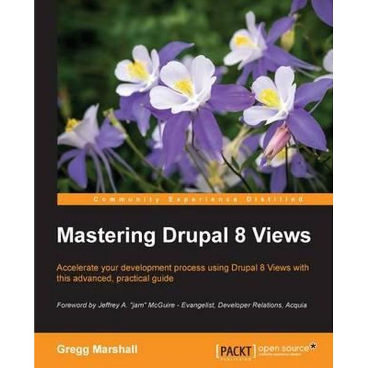
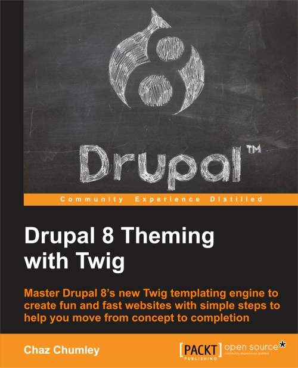
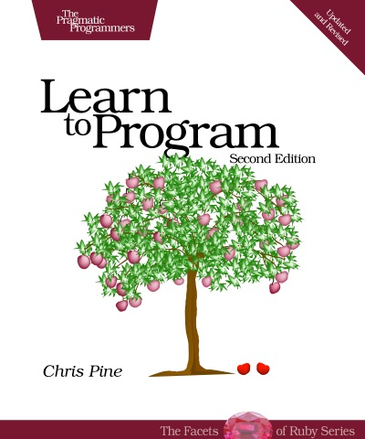

  
I have a tendency to read several books at time, especially when those books are instructional. I’m not suggesting this is an effective way to read, but I get into one book because of a project, and then I start a new project, and I pivot to another book. 

At the moment, I’m reading the following books.

## Drupal

We’re currently moving to Drupal 8 at my place of work. Although we’re hiring agency to build Drupal, I’m conducting the content audit that will inform the information architecture, and I’m wireframing landing pages to take advantage of Drupal Views and Paragraphs.

[**Mastering Drupal 8 Views**](https://www.packtpub.com/web-development/mastering-drupal-8-views) - Gregg Marshall

Views has been such an integral and popular module in Drupal, it is now integrated into Drupal Core in version 8.

Views allows you to aggregate similar content from across a website based on certain conditions. It is extremely powerful.

[**Drupal 8 Theming with Twig**](https://www.packtpub.com/web-development/drupal-8-theming-twig) - Chaz Chumley

The [Twig templating engine](https://twig.symfony.com/) has been integrated into Drupal 8. This is great for front-end types, because Twig has more kinship with HTML and other front-end technology than it does with PHP, which is how theming used to be coded into Drupal.

Twig has a lot in common with [Jekyll](https://jekyllrb.com/), [Handlebars](http://handlebarsjs.com/), and [Middleman](https://middlemanapp.com/), so it’s fairly easy to go back and forth from Drupal theming to theming with static site generators.

## JavaScript

After finishing up [JavaScript for Web Designers](https://abookapart.com/products/javascript-for-web-designers), I decided to read another well-regarded book on JavaScript: *Eloquent JavaScript*.

[**Eloquent JavaScript, Second Edition: A Modern Introduction to Programming**](http://eloquentjavascript.net/) - Marijn Haverbeke

This book is fantastic. It’s approachable, yet comprehensive (it even includes a short chapter on Node.js). 

I just finished the paperback copy, but [you can read it entirely online](http://eloquentjavascript.net/) for free, if you wish.

# Ruby

The only programming language I’ve consistently written in is Python, and most of that work was in the context of Esri ArcGIS. 

I would like to become more proficient in other programming languages, even though I rarely program.

[**Learn to Program**](https://pine.fm/LearnToProgram) - Chris Pine ([no, not that Chris Pine](http://www.imdb.com/name/nm1517976/))

An approachable book on Ruby, *Learn to Program* offers a concise introduction to programming by way of Ruby, but the key tenets are transferable to many other programming languages. For this reason, it’s a useful read to understand the basics of programming in general.

## Other books I’m reading

I am in the middle of several non-tech books as well. I’ll write about those in the next post. Perhaps someday I’ll limit myself to one book at a time!