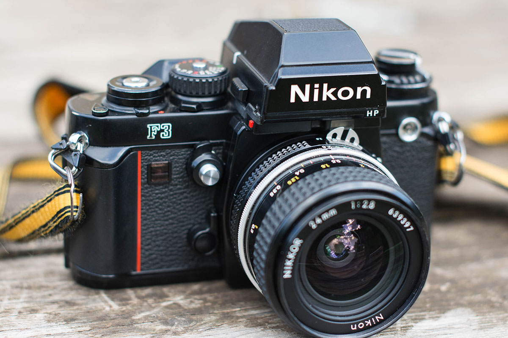
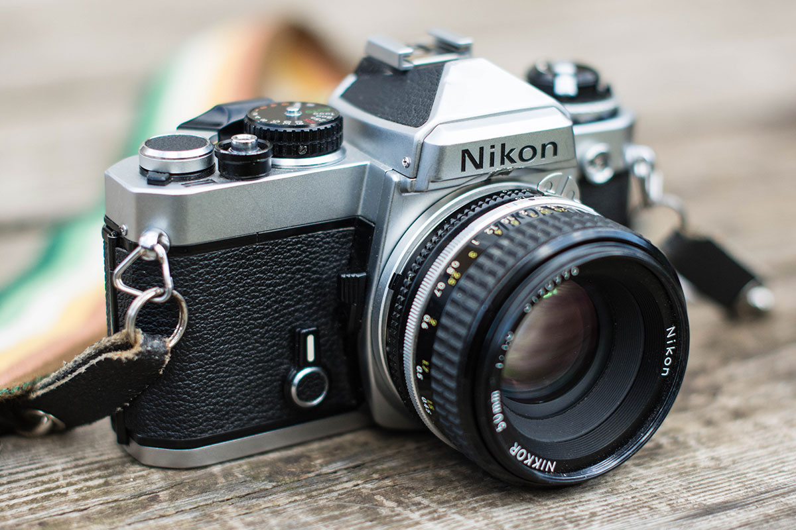

I’m old enough that digital photography wasn’t an option when I was in high school, and lucky enough that my tiny high school in the diminutive town I grew up in had a dark room and film photography curriculum. I grew up [bulk-loading film](https://www.lomography.com/magazine/199753-bulk-film-loading-or-how-to-roll-your-own-joint), shooting on the indestructible [Pentax K1000](https://en.wikipedia.org/wiki/Pentax_K1000), and developing my own negatives and prints. I didn’t realize how unusual that experience would become just a decade later.

## Slowing down with film
As I alluded to after [I visited Working Library](/working-library/) a few months ago, I’ve returned to shooting film in earnest. Apart from some professional headshots for a friend, I’ve shot almost exclusively on film this year. The nearly gratuitous ubiquity of photography in our lives, combined with the transience and vulnerability of storing and maintaining the record of my most precious moments exclusively in digital files, has compelled me to go back to shooting film as my default.

Recently while cleaning my home office, I discovered some negatives that I forgot (or never knew) existed. Most notably, I found some shots taken at our 2006 wedding that I didn’t even know existed. They’re medium-format shots that someone gave to us and are preserved perfectly in celluloid. If those photos had been digital files, I don’t know if they would still exist. I don’t know who took the photos, but had they been digital, we may have never seen them. Facebook wasn’t widely used at the time, Instagram didn’t exist, and sharing digital photos wasn’t particularly convenient back then. Furthermore, had the photos been shared on Facebook, they would have been relatively low quality and effectively owned by Facebook. Most importantly, [I’m not on Facebook anymore](/leaving-facebook/).

And then there’s the artifact. It’s difficult to imagine digital files being passed down generation after generation as film has been. Take this photo of my grandfather:

This photograph was taken over 50 years ago, and I have the physical slide stored in my home office, along with other family slides from both my parents’ collections. I can’t imagine not having these slides. I would never trust a hard drive to store these.  

On top of the benefits of the longevity of slides and negatives, I simply enjoy shooting on film. I appreciate the limits, the discipline it requires. The tactility of film is comforting and multi-sensory. And because my film cameras are over 30 years old, shooting film demands careful attention to exposure and focus, because they must be set manually. I have to slow down and consider everything about how and what I photograph. 

By shooting film, I know my photographs will be around long after their digital counterparts are gone. Hopefully they’ll be around long after I’m gone, too.

## The gear
I mostly shoot 35mm, so that’s what I’ll cover here. I’ve had Nikon gear for years (as conveyed below), but I’ve also shot Canon from time to time. I’m not religious about my choice of gear, but there is something to be said for the familiarity of decades of reliable use.

### Nikon F3HP
Years ago, my father bought a Nikon F3HP to take on a fishing trip to Alaska. He purchased the camera from a family friend, a professional photographer in our hometown. My dad isn’t particularly interested in photography, so he gave the camera to me when he got back from his trip. That was in 1998, and I’ve had it ever since.

The Nikon F3 is a beautiful and resilient piece of machinery. Introduced in 1980, Nikon continued producing the F3 until 2001, even after releasing the Nikon F4, F5, _and_ D1, the latter being Nikon’s first DSLR. Designed by [Giorgetto Giugiaro](https://en.wikipedia.org/wiki/Giorgetto_Giugiaro), famous for his automotive designs, the F3 was the first camera to the bear the iconic red accent that has defined Nikon cameras ever since. 

The attention to detail in this camera is special. For example, the F3’s construction [included 11 ball bearings in its film advance mechanism](http://www.mir.com.my/rb/photography/hardwares/classics/nikonf3ver2/htmls/index3.htm), which was beyond rare at the time. It is a smooth and precise camera in nearly every way.

I won’t go into the technical details of this camera, as  reviews are abundant, but you can’t go wrong with it. You can [pick one up for around $300](http://www.ebay.com/bhp/nikon-f3), and I recommend you do, especially if you’re about to drop $1000 or more on a new digital camera. You’ll also benefit from a plethora of used, inexpensive lenses that can easily be found online, at second-hand stores, and a few remaining camera shops.

For those who wear glasses, like me, the HP (“high eyepoint”) viewfinder allows for faster and more comprehensive framing, as your eye can be positioned slightly further away. And you can remove the prism and compose your shot from above, delivering a better ergonomic position for shooting low to the ground.

### Nikon FE
I have a 20-year history shooting the F3, but I have a  confession: the FE is _my camera_. I love this little machine.

I bought this FE just this year, and I haven’t regretted it a single time, having decisively – almost instinctively – reached for it when packing for vacation or weekend trips.

The FE is smaller, older, and less advanced than the F3. But it is so natural to use. As opposed to the LCD meter of the F3, the FE uses an analog needle for exposure. It’s much more intuitive for quick reading than even the momentary hesitation of interpreting the numbers from an LCD. It is smaller and lighter in hand and feels far less intrusive to both photographer and subject when shooting, particularly in confined settings.

Released in 1978, the FE – like the F3 – was shunned by many “purist” photographers reluctant to rely on electronics, preferring their fully manual cameras. But Nikon foresaw this and included a simple battery check lever that indicates the camera is ready to go.

Again, I love this little camera. If you are thinking about getting back into film, or shooting film for the first time, the Nikon FE is the way to go. [You can get one for under $200](https://www.ebay.com/sch/i.html?_nkw=nikon%20fe&ssPageName=GSTL).

## The best of both worlds
I don’t believe we need to choose between film and digital. I shot the photos above with my Nikon D7200, and I still prefer to shoot digital in certain circumstances.

But I shoot film more often than digital now for the aforementioned reasons, and I send my negatives to a local shop to be developed (although I’ve played around with the idea of developing my film at home). I don’t order prints, electing to scan the negatives and order only the prints I want, if any. My [Epson V600](https://www.bhphotovideo.com/c/product/647187-REG/Epson_B11B198011_Perfection_V600_Photo_Scanner.html) is a serviceable option for scanning negatives, although it can be time consuming.

Even so, part of the joy of shooting film is working with the negatives, feeling the actual celluloid in hand. You’re able to organize and store the persistent physical negatives while availing yourself of all the modern opportunities of digital publishing. 

It really is the best of both worlds. And for now, I’m happy to spend my time in the world that slows down and forces me to focus just a little longer.
