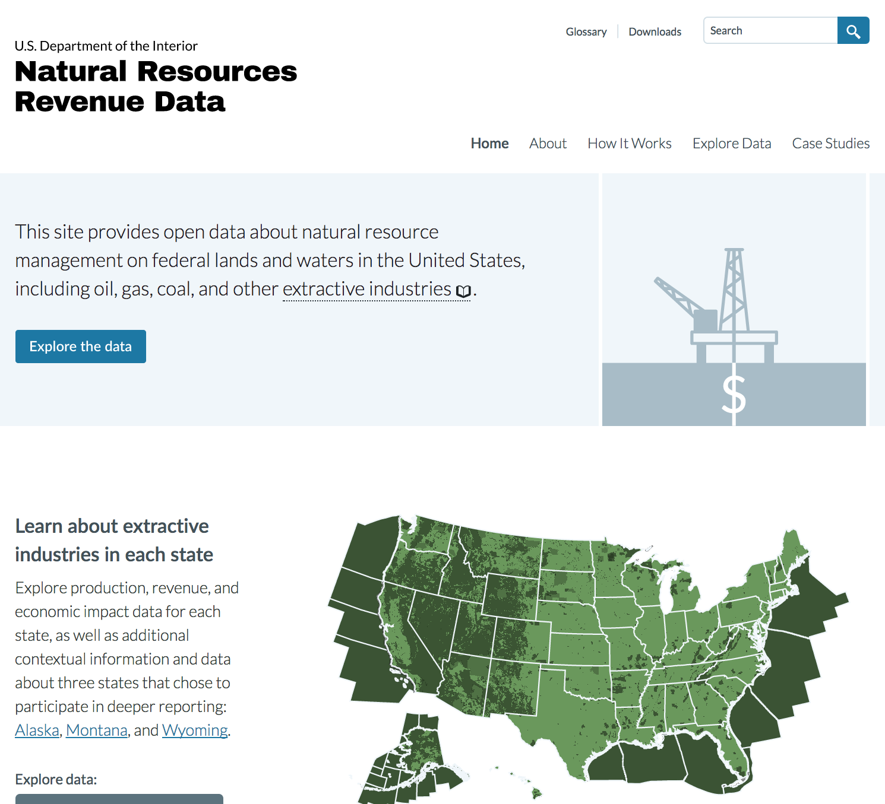

As 2017 comes to an end, I’m thankful to be working with talented, civic-minded people at the Department of the Interior and 18F. Admittedly, it’s a weird time to have started working in the federal government, but I’ve been encouraged by the commitment to open data and service delivery exemplified by the civil servants at both institutions.

I was brought in by the [Office of Natural Resources Revenue](https://www.onrr.gov/) to help [transition an 18F project into the department](/going-to-work-federal-government/). As a result, I’ve been able to work directly with the folks at 18F to modernize our process, while inheriting [a site elegantly designed to present public-lands data](https://revenuedata.doi.gov/).

[](https://revenuedata.doi.gov/)
<figcaption><a href="https://revenuedata.doi.gov/">Natural Resources Revenue Data</a></figcaption>

## Static is the new dynamic

Static site generators have been gaining momentum for several years now. I first read about the advantages of static sites on [Dave Cole’s 2012 blog post](https://developmentseed.org/blog/2012/07/27/build-cms-free-websites/). There’s even a site dedicated to the idea that “[static is the new dynamic](https://www.thenewdynamic.org/).”

I love working with static site generators; [I created this blog with Jekyll last year](/this-blog/) to ditch the database and host _for free_ on [GitHub Pages](https://pages.github.com/), proving Jekyll is [no longer just for hackers](http://tom.preston-werner.com/2008/11/17/blogging-like-a-hacker.html), but a flexible and viable solution for content creators to simplify their tech stack, ship content quickly, and save money. 

For all the advantages of static sites, I still wondered why such a data-heavy federal site would omit the database and go static, as the DOI site does. The answer appears to be two-fold:

1. Most of the data is pulled and deployed as flat `.csv` files (some data is deployed via an API)
2. The site is hosted on [Federalist](https://federalist.18f.gov/), a static site hosting service started by 18F

Of course, the site is also more secure, portable, and faster than a database-driven site, but it does require a technically proficient content team.

## Content that writes itself

The site I work on contains extractive data for all 50 states and federally owned offshore regions. As the only dedicated content manager for the site, it’s an imposing amount of content to maintain.

To reduce the maintenance burden, 18F designed the content to _update itself_ at build time, using [Liquid’s templating logic](https://shopify.github.io/liquid/) within Jekyll.

For example, if a particular state’s extractive sector contributes to the state’s GDP, Liquid will pull the data and print the result.

```liquid
 
  In {{ state_name }}, extractive industries accounted for
  <a href="#gdp">{{ gdp[include.year].percent | percent }}%
  of gross domestic product</a> (GDP) in {{ include.year }}
```

And if extractive sector employment comprises over 2% of the state’s total employment, Liquid will evaluate and print the related content.

```liquid
  , and jobs in the extractive industries made up <a href="#employment">{{ jobs_percent | percent }}% 
  of statewide employment</a>.
  
  
  Extractive industries did not have any effect on gross domestic product (GDP) in
  {{ include.location_name }} in {{ include.year }}.

```

Similar logic is used for state commodity production. The following will evaluate the state’s commodity production and print the related content if the state leads the country in the production of a specific commodity.

```liquid  


  
  
  {{ include.location_name }} leads the nation in production of:
    <ul>
    
    
    <li>{{ product.name | lookup: commodity_names }}: {{ product.percent | floor }}% of U.S. production</li>
    
      
    
    </ul>
  

```

You can review the full code on [GitHub](https://github.com/18F/doi-extractives-data/).

## Your content writes itself, but your work isn’t done

So you have content that writes itself, but if you’re updating the data that drives the content, you need to remain vigilant as an editor. For example, the GDP data referred to above is pulled into the site via an API (which itself needs to be maintained), so if the data isn’t updated properly or the source API is corrupted, the content may actually be misleading or outright false. It’s important to review the content regularly for accuracy and fidelity to the source data.

## It’s build time!

Static site generators are advantageous in part because the logic is evaluated at _build time_. That means the performance burden isn’t on the client request; it’s on the build _prior_ to deployment. Consequently, the site is much faster than if the logic was performed at browser request.

## Digging into the stack

I’m still digging into the code, so I’ll have more to share as I go along. Given my role is focused on content strategy and design, I haven’t worked much with the front-end, apart from what is required to update content. But there is much more to share, including employing Jekyll in combination with D3 for data visualization.

## In the meantime...

If you’re interested in using Jekyll for geospatial purposes, I recommend watching Katy DeCorah’s 2016 JekyllConf presentation [_Unconventional Use Cases for Jekyll_](https://www.youtube.com/watch?v=s84wFRD8vfE).

Katy’s presentation focuses on Jekyll and [Mapbox](https://www.mapbox.com/), and it’s a brief and informative look at how flexible Jekyll can be for geospatial purposes.