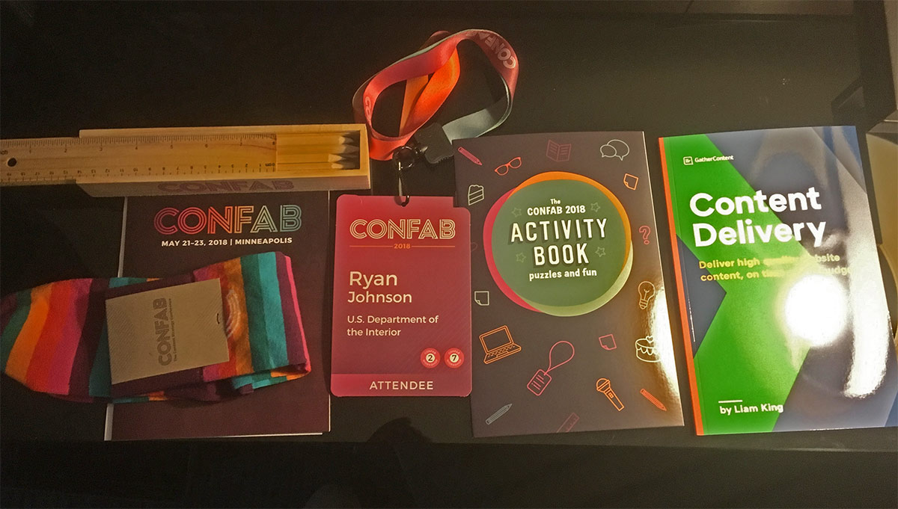

I just returned from [Confab](https://www.confabevents.com/) in Minneapolis. I last attended Confab (in its “Intensive” format) in Portland back in 2015. This year, Confab confirmed it’s different than any other conference I’ve been to.

Don’t get me wrong, Confab – like all conferences – is at times reminiscent of high school, with its cliques and social hierarchies. (All conferences thrive off of the exclusivity of hierarchies; if every conference attendee is understood to have the same level of knowledge and expertise, why would anyone attend a presentation by someone else?)

Overall, Confab’s attendees are some of the best people I’ve met in my career. As a result, Confab is a unique conference. Those drawn to content strategy are disproportionately empathetic, well-read, and motivated, which makes for a comfortable, illuminating conference experience.

## Confab is thoughtful

Confab is, in a word, _thoughtful_. From the swag bags to the dedicated introverts’ room (a different kind of “escape room”), the Confab team is considerate, empathetic, and anticipatory. And fun, of course.

<figcaption>Confab swag included colored pencils in a box (with a ruler lid), an activity book, and socks(!), among other good stuff.</figcaption>

 
The thoughtfulness extended beyond the planning and into the sessions (and, hopefully, our work). Two opening-day talks set out major themes for the week:

* [Inclusive content, ethical tech, and you](https://www.confabevents.com/2018-sessions/inclusive-content-ethical-tech-and-you)
* [Speaking truth to power: How to build equity through writing and design standards](https://www.confabevents.com/2018-sessions/speaking-truth-to-power-how-to-build-equity-through-writing-and-design-standards)

## Takeaways

* I tend to limit the number of documents I create and impose on my team members, but I learned at this conference that each tool and resulting artifact surfaces the work and demonstrates the collaborative and intentional process behind strategic recommendations. The artifacts aren’t annoying; they’re integral.
* Breaking pieces of content down to reveal each respective attribute can help with content meaning and organization. Sometimes these attributes are implicit, but they should be articulated and agreed upon. Malaika Carpenter’s talk [_Solo content strategy: Lessons for lone rangers and tiny teams_](https://www.confabevents.com/2018-sessions/solo-content-strategy-lessons-for-lone-rangers-and-tiny-teams) was excellent, and covered this process for those working alone or on small teams.
* I first read [How to Make Sense of Any Mess](http://www.howtomakesenseofanymess.com/) over a year ago, but author Abby Covert’s talk [_Language: Your organization’s most important and least valued asset_](https://www.confabevents.com/2018-sessions/language-your-organizations-most-important-and-least-valued-asset) drove home the (informative) distinction between _content_ and _information_ articulated in her book. To put it simply, content is what we can control as structured, _intended_ meaning; information is what the audience interprets from that content. Our work is focused on designing the content in such a way as to promote understanding, but “content” and “information” are not synonymous.

## Confab and tech

It’s a minor matter, but Confab this year – as with the 2015 edition – lacked sessions sufficiently covering the intersection of content strategy and tech, specifically the ways in which a tech stack can be harnessed _within_ an overall content strategy. I found myself hungry for presentations that could inform aspects of my work with [data-driven content design](/content-writes-itself/#content-that-writes-itself).

The omission of specific examples of content strategy and tech can also be viewed as a Confab strength: an effective content strategy _should not_ be driven by a particular tech stack. It should be largely technology agnostic, focused on the requirements necessary to meet user needs, with the choice of tech coming late, if not last. A technology decision must be made, though, and that decision will impact how accessible, flexible, and maintainable the content can be. Often, technology will determine how _effective_ content can be at reaching its target audience when and where they need it. Content effectiveness is inextricably linked to its delivery mechanism.

Like the industries they cover, conferences are becoming more and more specialized in subject matter. I’ve tried to cultivate a generalist skillset over time, which may limit my ability to excel at any one discipline. But it also enhances my overall understanding of the opportunities and constraints imposed by technology on my publishing environment. I would like to see sessions that acknowledge the fact that many of us, either because we work alone or on small teams with complex tech stacks, have to become proficient in the area where the content meets the code.

Overall, Confab remains the conference I most look forward to attending, with the people I most relate to. So keep it coming, word nerds.