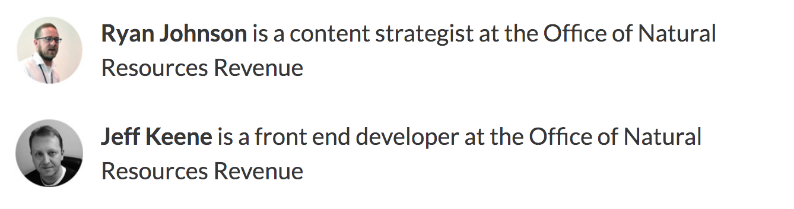

This post kicks off a series on how our options as content designers can be expanded or limited based on our site architecture. And while content strategists are often dependent on other team members (i.e., developers) to scope the desired features and build the supporting architecture, understanding how your architecture is built (or can be built) can spark your content design process. Your understanding of the architecture is the foundation for thinking creatively about how your content can be rearranged, combined, or supplemented to support your content strategy. In other words, how your content can be designed.

Although they’re often regarded as separate disciplines, information architecture and content design are inseparably linked. Most content strategists understand how information architecture can expand or limit options for designing and delivering quality, structured content to users. And while many content strategists think of information architecture in terms of metadata and taxonomy, this series examines the architecture of the content itself (along with its metadata). We might think of this as _content architecture_.

So what do we mean when we talk about content architecture? What variables impact our options for how content is designed and published? 

In this series, we’ll look at examples of content architecture, and how it limits or expands our options as content designers. Doing so will require examining some technical frameworks for web products, with the understanding that content designers and content strategists should be involved in scoping technology frameworks and software products. Because software tools impact our content design options, evaluating those tools is unavoidable in any discussion of the intersection of content and architecture.

## Example 1: GatsbyJS data mapping

Our first example will look at using a specific framework ([GatsbyJS](https://www.gatsbyjs.org/)) and configuration feature (mapping) to structure our content to promote flexibility and decrease repetition.

### Aside: DRY content

DRY (don’t repeat yourself) is a principle of software development to promote clarity and maintainability of a codebase. The DRY principle is a friend of content strategists as well: we’ve all seen repetitive content that makes it more difficult to parse and understand, for example:

> - The DRY principle is good for clarity.
> - The DRY principle is good for maintainability.
> - The DRY principle is good for efficiency.

Let’s make this DRY:

> The DRY principle is good for:
> - clarity
> - maintainability
> - efficiency

The DRY principle is useful for our architecture, which impacts our workflow.

Let’s look at an example. I’ve been building a blog for our team at the Department of the Interior. The blog is a vehicle to communicate how we work on the [natural resources revenue open data site](https://revenuedata.doi.gov/).

Our blog posts are authored in [markdown](https://en.wikipedia.org/wiki/Markdown) as static files. We then use GatsbyJS to compile the files and build a static website.

I’m not new to markdown, but I am new to Gatsby and [React](https://reactjs.org/). Since we’re transitioning our open-data site from Jekyll to Gatsby, I figured building the blog would be a good way to level up on content management in Gatsby.

I started by forking the [`gatsby-starter-blog`](https://github.com/gatsbyjs/gatsby-starter-blog). The starter assumed only one author, the professional details for whom were hard-coded in a React component (`Bio.js`). I knew many (if not most) of our blog posts would involve more than one author, so I started working on how to modify the starter to include two or more authors.

### Modifying the blog template

Each blog post’s front matter contains its metadata, including the author(s) of the post.

Here’s an example:

```yaml

title: Why we're moving to GatsbyJS
authors: 
- Ryan Johnson
- Jeff Keene
excerpt: We're moving from Jekyll to GatsbyJS as the static-site generator for our open-data site. Here's why.
tags:
- default
- boilerplate
- gatsbyjs
- react
date: "2018-09-24"
draft: yes

```

Instead of having a hard-coded component with one author, we can include the author(s) in the front matter of the post.

Then, we can modify the blog post template to loop over the author(s) and include information about each author at the end of the post:

``` react 
      {
        (post.frontmatter.authors).map((author, index) => (
          <div key={index}
            style={{
              display: 'flex',
            }}
          >
            
            <p
              style={{
                marginRight: rhythm(1 / 2),
              }}
            ><strong>{author.id}</strong> is a {author.bio}
            </p>
          </div>
        ))
}

```

We’re not going to cover it in this post, but you also need to add the front matter variables to your post template’s [GraphQL](https://www.gatsbyjs.org/docs/querying-with-graphql/) query.

_Hang with me here!_ 🙂

So far, we’ve changed the blog post template to look at each author listed in the front matter and publish details about them at the end of each post:


- `author.pic` (photo)
- `author.id` (name)
- `author.bio` (job title and organization)


Here’s what it should look like when provided the front matter from above:



### Mapping to data files

You may have noticed we’re only listing the name of each author in the front matter, but the template is pulling in a pic and bio. This is where the DRY principle comes in.

When I initially modified this blog template, it required the post author(s) to reference their image file path and bio in _every_ blog post’s front matter; it required repeating the exact same content every time an author wrote a post. It was annoying, error-prone, and time consuming.

Thankfully, Gatsby has a powerful configuration setting that lets us map an `id` to a separate file, allowing us to draw the contents of a separate data file into our blog post based on a shared `id`.

So to do this, we need a data file (in this case, `authors.yml`) with all possible authors, along with their profile image paths and bios:

``` yaml
- id: Ryan Johnson
  bio: content strategist at the Office of Natural Resources Revenue
  pic: /img/ryan-pic.jpg

- id: Jennifer Malcolm
  bio: product manager at the Office of Natural Resources Revenue
  pic: /img/jennifer-pic.jpg

- id: Chris Mentasti
  bio: program analyst at the Office of Natural Resources Revenue
  pic: /img/chris-pic.jpg

- id: Shannon McHarg
  bio: user experience designer at the Office of Natural Resources Revenue
  pic: /img/shannon-pic.jpg

- id: Jeff Keene
  bio: front end developer at the Office of Natural Resources Revenue
pic: /img/jeff-pic.jpg
```

Nice! 😎 

Now we need to create the link. Presumably because these fields are mapped from different files across the codebase, the centrality of the `gatsby-config.js` file lends itself to creating the linkage. So we add the following to the config file:

``` javascript
  mapping: {
    "MarkdownRemark.frontmatter.authors": `AuthorYaml`,
},
```

This links up the `id`s in each file and associates the extra fields in `authors.yml` with the author(s) in the front matter. Once again, you’ll need to query the data in your GraphQL query in the blog post template.

### We did it!

Phew! We made it happen!

We could make this even DRYer by creating a variable for the part of the bio that is common to each author (“...at the Office of Natural Resources Revenue”) and concatenating job title with that variable. That way, if we want to change “Office of Natural Resources” to “Department of the Interior,” we only have to change the variable, not each instance in the data file.

I realize many of us work with developers to do this kind of thing, but it’s always useful to know the options and limitations of the tools you’re working with. For instance, we can now create a page for each author that contains a list of all posts they wrote. We can query all posts that two individual authors worked on. Or we can add a twitter field to the data file and include it with each author’s bio. Most importantly, we can keep our authoring and content management workflow simple by mapping one field to supporting content automatically.

Of course, Gatsby isn’t alone in having a mapping feature like this, but it’s important to know what features you have at your disposal to build your architecture and design your content around.

Next time, I’ll cover how to pull in custom content based on unusual or anomalous circumstances.